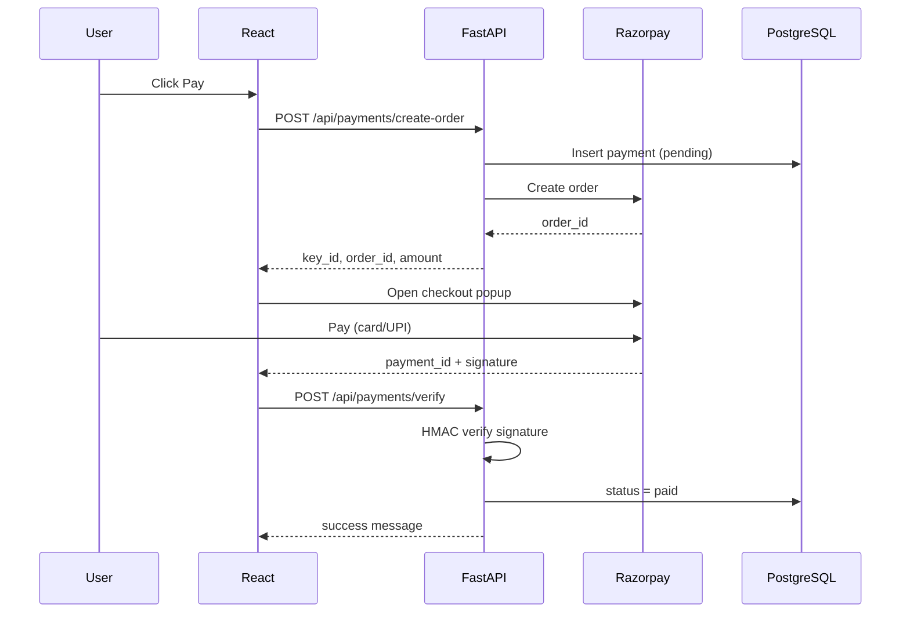

# Razorpay payment integration — setup guide

This project uses **Razorpay Checkout** with a **FastAPI** backend (secret keys server-only) and **React** frontend (Axios + checkout popup).

## Architecture



| Layer | Responsibility |
|-------|----------------|
| `frontend/src/lib/razorpay.ts` | Load checkout.js, open popup |
| `frontend/src/pages/Payment.tsx` | Generic payment UI |
| `frontend/src/pages/Donate.tsx` | Temple donations via `/api/donations/*` |
| `backend/app/services/razorpay_service.py` | Orders, signatures, refunds |
| `backend/app/routers/payments.py` | REST + webhook |
| `backend/app/models/payment.py` | `payments` table |

## 1. Create a Razorpay account

1. Go to [https://razorpay.com](https://razorpay.com) and sign up.
2. Complete business KYC for **live** mode (test mode works immediately for development).

## 2. Get test API keys

1. Open [Razorpay Dashboard](https://dashboard.razorpay.com).
2. Ensure **Test Mode** is ON (toggle top-left).
3. Go to **Account & Settings → API Keys → Generate Key**.
4. Copy **Key Id** (`rzp_test_...`) and **Key Secret** (shown once).

Add to `backend/.env`:

```env
RAZORPAY_KEY_ID=rzp_test_xxxxxxxx
RAZORPAY_KEY_SECRET=your_secret_here
RAZORPAY_WEBHOOK_SECRET=whsec_from_webhook_settings
```

Never put `RAZORPAY_KEY_SECRET` in the frontend or commit `.env`.

## 3. Run PostgreSQL

```bash
./scripts/setup-db.sh
# or: docker compose up -d db
```

## 4. Run the backend

```bash
cd backend
python3 -m venv .venv
source .venv/bin/activate
pip install -r requirements.txt
cp .env.example .env
# Edit .env with Razorpay keys
uvicorn app.main:app --reload --host 0.0.0.0 --port 8000
```

API docs: [http://localhost:8000/docs](http://localhost:8000/docs)

## 5. Run the frontend

```bash
cd frontend
npm install
npm run dev
```

- Payment page: [http://localhost:5173/pay](http://localhost:5173/pay)
- Donate (Razorpay): [http://localhost:5173/donate](http://localhost:5173/donate)
- History: [http://localhost:5173/payments/history](http://localhost:5173/payments/history)

## 6. Test a payment

1. Open `/pay`, enter amount ≥ ₹1, name, and email.
2. Click **Pay with Razorpay**.
3. In the popup, use Razorpay **test** instruments (below).
4. After success, the app calls `POST /api/payments/verify` and shows a confirmation.

## 7. Razorpay test cards & UPI

From [Razorpay test docs](https://razorpay.com/docs/payments/payments/test-card-upi-details/):

| Method | Details |
|--------|---------|
| **Success card** | `4111 1111 1111 1111`, any future expiry, any CVV |
| **Failure card** | `4000 0000 0000 0002` |
| **Test UPI** | `success@razorpay` (success) or `failure@razorpay` (failure) |

Use any name and OTP if prompted in test mode.

## 8. Webhooks (bonus)

1. Dashboard → **Webhooks → Add New Webhook**.
2. URL (local dev use [ngrok](https://ngrok.com)): `https://YOUR_HOST/api/payments/webhook`
3. Events: `payment.captured`, `payment.failed`, `refund.processed`
4. Copy **Webhook Secret** → `RAZORPAY_WEBHOOK_SECRET`

Webhooks reconcile payments if the user closes the browser before `/verify` runs.

## 9. Refund API (admin)

Requires admin JWT from `POST /api/auth/login`:

```bash
TOKEN="..."
curl -X POST "http://localhost:8000/api/payments/1/refund" \
  -H "Authorization: Bearer $TOKEN" \
  -H "Content-Type: application/json" \
  -d '{"notes": "Customer request"}'
```

Omit `amount_rupees` for a full refund.

## 10. Docker (full stack)

```bash
cp backend/.env.example backend/.env
# Add Razorpay keys to backend/.env

docker compose up --build
```

- API: [http://localhost:8000](http://localhost:8000)
- Web (nginx): [http://localhost:3000](http://localhost:3000)

## API reference

| Method | Path | Description |
|--------|------|-------------|
| POST | `/api/payments/create-order` | Create order + DB row |
| POST | `/api/payments/verify` | Verify signature, mark paid |
| GET | `/api/payments/history?email=` | List by email |
| POST | `/api/payments/webhook` | Razorpay events |
| POST | `/api/payments/{id}/refund` | Admin refund |
| POST | `/api/donations/create-order` | Temple donation order |
| POST | `/api/donations/verify` | Donation verify |

## Security checklist

- [x] Secret key only in backend `.env`
- [x] Payment signature verified with HMAC-SHA256
- [x] Webhook signature verified with webhook secret
- [x] Pydantic validation on all request bodies
- [ ] Production: protect `/payments/history` with auth or OTP
- [ ] Production: HTTPS only, live keys, webhook on public URL

## File map

```
backend/
  app/models/payment.py          # SQLAlchemy Payment model
  app/schemas/payment.py         # Pydantic schemas
  app/services/razorpay_service.py
  app/routers/payments.py
  app/core/logging_config.py
  app/core/exceptions.py
frontend/
  src/lib/razorpay.ts
  src/pages/Payment.tsx
  src/pages/PaymentHistory.tsx
  src/components/PaymentStatusBanner.tsx
  src/types/payment.ts
```
